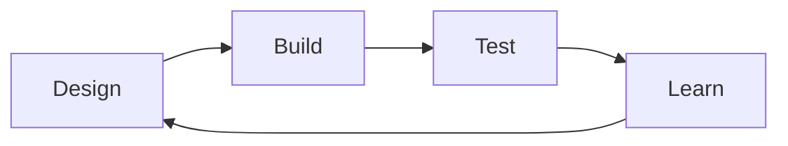
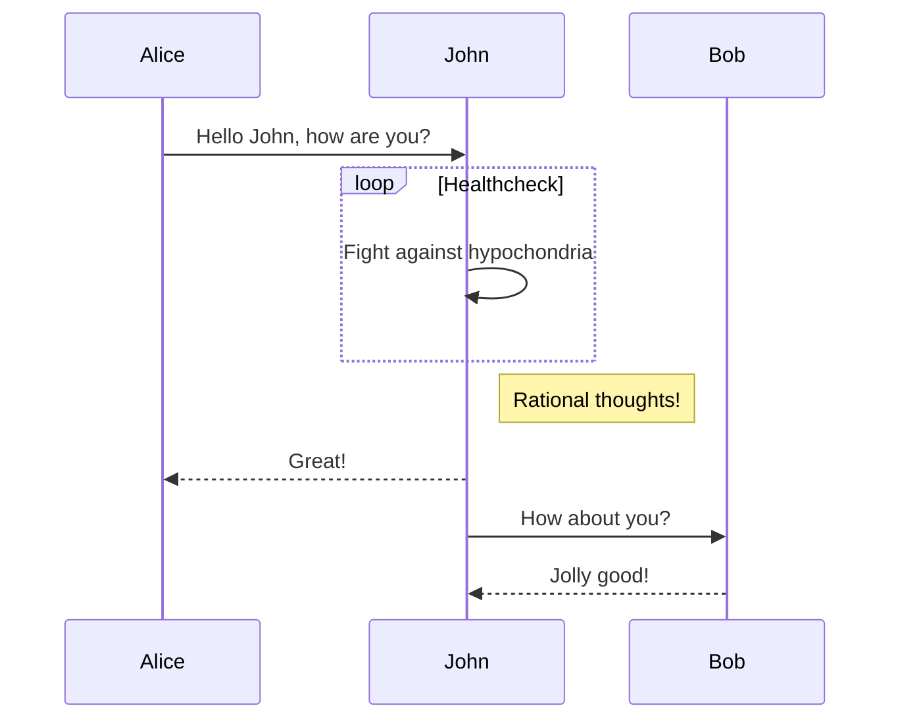
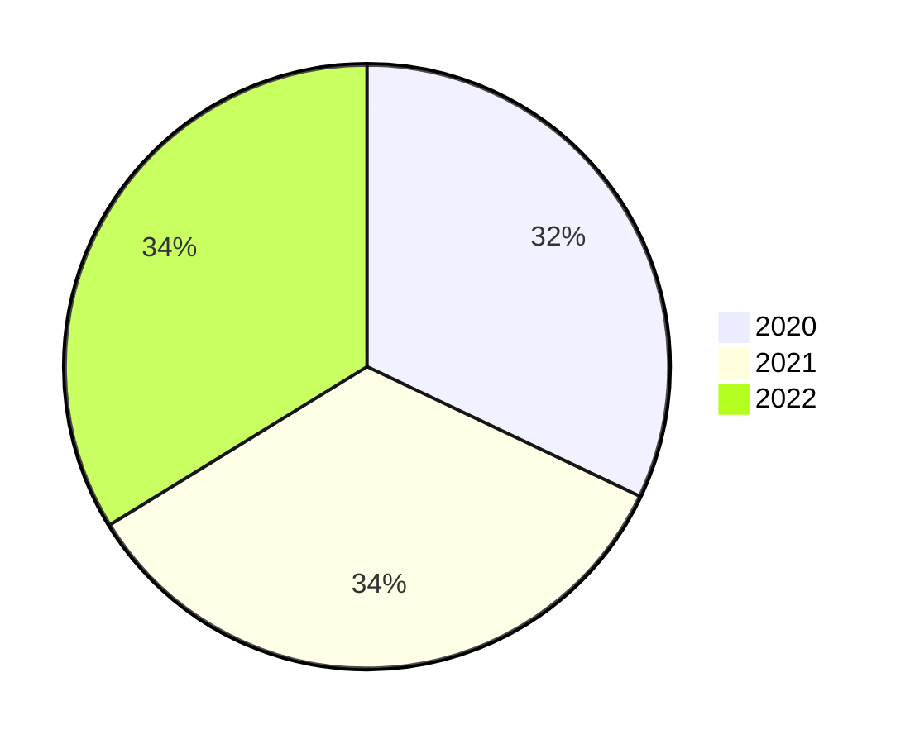

# How to edit documents

This website is built using [vitepress](https://vitepress.vuejs.org/). This allows markdown files to be rendered with more functionality than the original syntax. For these features, you can refer to the vitepress's document of [markdown](https://vitepress.vuejs.org/guide/markdown).

The following is just a brief introduction.

[[toc]]

## Frontmatter

> Any Markdown file that contains a YAML frontmatter block will be processed by [gray-matter](https://github.com/jonschlinkert/gray-matter). The frontmatter **must be at the top of the Markdown file**.
> 
> —— [vitepress document](https://vitepress.vuejs.org/guide/frontmatter)

### Example

```md
---
title: How to edit documents
author: Weiwei Qian
link: https://github.com/497363983
---
```

The variables in the frontmatter can be the config of [vitepress](https://vitepress.vuejs.org/config/frontmatter-configs). And also can be a custom variable in this page, which can be used in the page.

### Example

***

#### Input:

```md
---
title: How to edit documents
---

{{$frontmatter.title}}
````

#### Output:

{{$frontmatter.title}}

***

What's more, the frontmatter can also be a json.

```md
---
{
    "title": "How to edit documents"
}
---
```

And there are some custom configs in our documents:

| Variable | Description                                                                                                                         | Default             |
| -------- | ----------------------------------------------------------------------------------------------------------------------------------- | ------------------- |
| author   | The author's name. If you don't define this variable, the username you set up in git will be automatically retrieved as the author. | git.config.username |
| link     | A link to the author's profile                                                                                                      | null                |

## Head

You can use ```#``` to set a head(Although you can use HTML head tags, we don't advice you do like this).

### Example

***

#### Input

```md
# Heading level 1

## Heading level 2

### Heading level 3

#### Heading level 4

##### Heading level 5
```

#### Output

# Heading level 1

## Heading level 2

### Heading level 3

#### Heading level 4

##### Heading level 5

***

:::danger Attention
Please just use **only one** level 1 head in a page. The level 1 head should be the title of whole page, and the information of the article will be automatically added after the level 1 head.
:::

## Images

We don't advice you to use the markdown's image syntax because the image size is not controllable. Please use the custom component [imgViewer](https://github.com/497363983/dry-lab/blob/main/docs/.vitepress/theme/components/imgViewer.vue) to show images. It can not only control the size of the image, but also can add the image note.

### Example

***

#### Input

```md
//markdown's image syntax


//imgViewer component

```

#### Output


***

### Props

| Props   | Description                   | Type           | Default |
| ------- | ----------------------------- | -------------- | ------- |
| width   | The width of image            | String         | 100%    |
| src     | The path of image             | String         | -       |
| index   | The index of image            | String\|Number | null    |
| caption | The content of image note     | String         | ""      |
| alt     | The alt attributes of img tag | String         | ""      |

:::tip
The ```src``` prop just need to be the path under the folder ```public```. For example, the image in ```docs/public/img/test.png``` just need to set the ```src``` prop to ```/img/test.png```.
:::

## Math

We use [katex](https://katex.org/docs/api.html) to provide math support. It supports much (but not all) of LaTeX and many LaTeX packages. See the [list of supported functions](https://katex.org/docs/supported.html).

### Example

***

#### Input

```md

    //inline math
    This is an inline math: $a+b$

    //block math
    $$
    a^2+b^2=c^2
    $$

```

#### Output

This is an inline math: $a+b$

$$a^2+b^2=c^2$$

***

## Mermaid

Mermaid is a JavaScript-based diagramming and charting tool that uses Markdown-inspired text definitions and a renderer to create and modify complex diagrams. It can draw [flowchart](http://mermaid-js.github.io/mermaid/#/flowchart), [Sequence diagram](http://mermaid-js.github.io/mermaid/#/sequenceDiagram), [class diagrams](http://mermaid-js.github.io/mermaid/#/classDiagram), [state diagrams](http://mermaid-js.github.io/mermaid/#/stateDiagram), [entity relationship diagrams](http://mermaid-js.github.io/mermaid/#/entityRelationshipDiagram), [user journey diagram](http://mermaid-js.github.io/mermaid/#/user-journey), [gantt diagrams](http://mermaid-js.github.io/mermaid/#/gantt), [Pie chart diagrams](http://mermaid-js.github.io/mermaid/#/pie), [requirement diagram](http://mermaid-js.github.io/mermaid/#/requirementDiagram), [git graph](http://mermaid-js.github.io/mermaid/#/gitgraph), [C4](http://mermaid-js.github.io/mermaid/#/c4c), [mindmap](http://mermaid-js.github.io/mermaid/#/mindmap).

See the [mermaid document](http://mermaid-js.github.io/mermaid/#/) to know whole features.

### Flowchart

```md
    ```mermaid
    flowchart LR

    A[Design] --> B[Build]
    B --> C[Test]
    C --> D[Learn]
    D --> A
    ```
```



### Sequence diagram

```md
    ```mermaid
    sequenceDiagram

    Alice->>John: Hello John, how are you?
    loop Healthcheck
        John->>John: Fight against hypochondria
    end
    Note right of John: Rational thoughts!
    John-->>Alice: Great!
    John->>Bob: How about you?
    Bob-->>John: Jolly good!
    ```
```



### Pie chart

```md
    ```mermaid
    pie
    "2020": 168
    "2021": 179
    "2022": 177
    ```
```



## Emoji

```md
:school: :school_satchel:
```

:school: :school_satchel:
